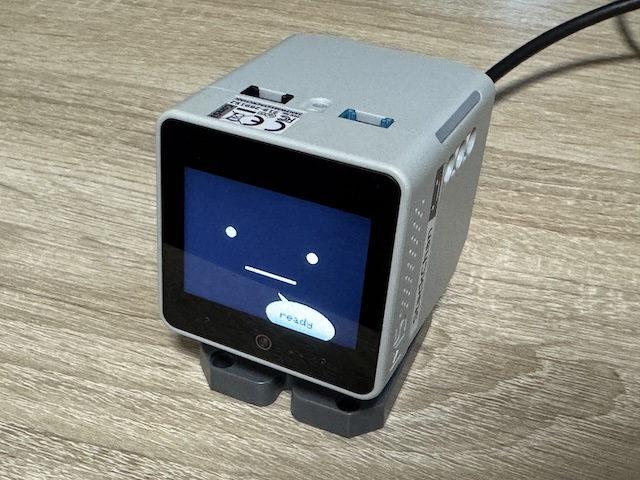

# xangi-stackchan



[xangi](https://github.com/karaage0703/xangi)（AI アシスタントフレームワーク）の `GET /api/events/stream` を購読してスタックチャン系デバイスを物理ペットのように動かす、常駐ブリッジ + Arduino ファームウェア。xangi の応答に合わせて表情・首振り・音声合成を実機側で再生する。

## できること

- xangi が考え始めるとデバイスが `doubt` 顔 + 首をかしげる
- xangi が話し始めると `happy` 顔になる
- `turn.complete` の最終テキストを piper-plus / VOICEVOX で音声化して再生。再生中は首がささやかに揺れる
- 完了後は `neutral` 顔 + idle ポーズに戻る
- `agent.error` では `sad` 顔 + 首を下げる
- **スプライト顔モード (`--face-mode sprite`)**: `spritesheet.webp` を LCD 用 JPEG に変換して表示。row/state + filled-frame tick でまばたき/表情アニメーションする。スプライト本体は `assets/pets/...` にローカル配置し、リポジトリにはコミットしない
- **バッテリー表示**: CoreS3 の残量を Avatar / スプライト顔の右上に表示し、`STATUS` に `battery_level` などを含める
- **状態表示LED**: CoreS3 Grove PORT.B の Puzzle Unit WS2812E と、M5Stack 公式 StackChan K151 / K151-R の本体 12 RGB LED を自動検出し、思考中 (`thinking`) / 発話中 (`talking`) / エラー (`error`) に合わせて点灯する。未接続・旧ファームでは自動で無効化
- **カメラスナップショット**: 内蔵 GC0308 カメラで JPEG 撮影 → 設定 UI / API で表示。LLM 連携は将来別 PR で対応
- **アタマセンサ なでなで**: M5Stack 公式 StackChan K151 内蔵の Si12T 容量タッチ (3 ch) で Press / Release / Swipe を検出。Press で `nade nade!` Avatar 顔 + host へ `head_touch` event 通知
- **音声対話モード (`--voice-conversation`)**: K151 のアタマセンサ tap で内蔵 PDM マイク録音 → 無音検出で自動停止 → faster-whisper STT (Silero VAD) → xangi `POST /api/chat` 投入。xangi 応答が piper-plus / VOICEVOX で発話される end-to-end ループ。詳細 `docs/usage.md` の「音声対話モード」

表示 UI は持たず、デバイスの表情変更と音声再生に集中する。サーボの有無は起動時に自動判定され、サーボ無しの CoreS3 単体機では MOVE のみ unavailable 応答 (WAV/FACE/CAPTURE は通常動作) する graceful degradation 設計。

## 対応デバイス

USB シリアル経由で Arduino (PlatformIO) ファームを焼く。機種ごとの本体ファームは `firmware/examples/<machine>/main/` に置かれていて、共通シリアルプロトコル (STATUS / VOLUME / WAV / FACE / IMAGE / MOVE / CAPTURE / PUZZLE) を実装する。未搭載のハードは graceful degradation で `unavailable` 応答。

| デバイス | ファーム (PlatformIO env) | baud | MOVE | CAPTURE |
|---------|---------|------|------|---------|
| M5Stack 公式 K151 / K151-R (CoreS3 + サーボ + Remote) | `cores3-main` | 921600 | ✅ | ✅ |
| M5Stack CoreS3 単体 (サーボ無し) | `cores3-main` | 921600 | 🚫 | ✅ |
| M5Stack AtomS3R + Atomic Voice Base / Echo Base (ES8311) | `atoms3r-main` | 115200 | 🚫 | 🚫 |
| M5Stack Basic + アールティ Ver.β (SCS0009 ×2) | `basic-main` | 115200 | ✅ | 🚫 |

CoreS3 系の本体ファーム (`cores3-main`) はサーボ・カメラ有無を起動時に自動検出、`STATUS` の `servo` / `camera` フィールドで現状を取得できる。

## 構成

```
xangi (:18888)
  └─ GET /api/events/stream (SSE)
      └─ xangi-stackchan (host bridge, Python)
          ├─ thread_id filter
          ├─ piper-plus persistent process
          └─ device (USB serial 共通プロトコル: STATUS / FACE: / IMAGE:<size> / WAV:<size> / VOLUME: / MOVE: / CAPTURE / PUZZLE:)
              ├─ M5Stack CoreS3 (K151 / K151-R / 単体機、firmware/examples/cores3/main、baud 921600)
              ├─ M5Stack AtomS3R + Atomic Voice/Echo Base (firmware/examples/atoms3r/main、baud 115200)
              └─ M5Stack Basic + アールティ Ver.β (firmware/examples/basic/main、baud 115200)
```

## クイックスタート

```bash
git clone https://github.com/karaage0703/xangi-stackchan.git
cd xangi-stackchan
uv sync
./scripts/setup_piper.sh

uv run xangi-stackchan \
  --xangi-url http://127.0.0.1:18888 \
  --port /dev/stackchan \
  --tts piper
```

起動すると設定 UI が `http://127.0.0.1:7897/` で立ち上がる。xangi URL / 接続先 / 音量 / TTS / 表情をブラウザから変更でき、保存すると `~/.xangi/xangi-stackchan/config.json` に永続化される。

### 実機なしでブラウザシミュレータを開く

スタックチャンが手元に無いときは `--simulator` で USB/WiFi に接続しない in-memory backend を起動できる。既存の xangi SSE 処理・FACE/MOVE/WAV/PUZZLE コマンドはそのまま流れ、ブラウザ `http://127.0.0.1:7897/simulator` に顔・首角度・ライト・発話状態が反映される。

```bash
uv run xangi-stackchan \
  --xangi-url http://127.0.0.1:18888 \
  --simulator \
  --speak-platforms web \
  --tts piper
```

シミュレータ画面のボタンや `POST /api/simulator/command` から `FACE:happy` / `MOVE:20,8` / `PUZZLE:thinking` などのプロトコルコマンドを手動送信できる。`/api/simulator/state` は現在状態を JSON で返すので、UI 開発やデモの確認にも使える。xangi Web UI の入力に反応させたい場合は `--thread-id` を付けず、`--speak-platforms web` で Discord 等のイベントだけを除外する。音声をブラウザで鳴らすには `--tts piper` / `--tts voicevox` で起動し、シミュレータ画面の `enable audio` を一度押す。

## 複数台で動かす

xangi-stackchan は同じマシンで複数プロセスを並列起動できる (1 プロセス = 1 スタックチャン)。

```bash
# 左 (settings UI: 7897)
uv run xangi-stackchan --instance-id left  --port /dev/stackchan-left  --thread-id left  --settings-port 7897 --tts piper &

# 右 (port 7897 が埋まっているので auto-shift で 7898 になる)
uv run xangi-stackchan --instance-id right --port /dev/stackchan-right --thread-id right --settings-port 7897 --tts piper &
```

- 設定 UI の port は `7897` 起点で `+1` ずつ最大 `--port-autoshift-tries` 回 (既定 `10`) auto-shift する
- `~/.xangi/xangi-stackchan/config.json` は v2 schema で `instances.<id>` namespace を持つ。`--instance-id` で分離 (既存の v1 フラット config は初回保存時に `instances.default` へ自動移行)
- 2 台以上挿す場合は udev でシリアル番号別の SYMLINK を切って物理デバイスを固定する (例 `/dev/stackchan-left` / `/dev/stackchan-right`)
- デフォルトでは全プロセスが同じ xangi イベントを受けて一斉に喋る (broadcast)。喋り分けたいときは xangi 側で thread を分けて、各プロセスに `--thread-id` を渡す

詳細 (udev rules サンプル、systemd 設定例、SSE routing の挙動) は [`docs/usage.md`](./docs/usage.md) の「複数台で動かす」セクションを参照。

詳細なセットアップ・オプション・常駐起動・トラブルシュートは [`docs/usage.md`](./docs/usage.md) を参照。

## AI エージェント連携

[`SKILL.md`](./SKILL.md) を参照。Claude Code 等の AI エージェントから本ブリッジを起動・操作してスタックチャンを動かすための手順を集約してある。

## ドキュメント

- [`docs/usage.md`](./docs/usage.md): セットアップ・オプション・常駐起動・デモ・トラブルシュート
- [`docs/xangi_bridge_protocol.md`](./docs/xangi_bridge_protocol.md): USB シリアル共通プロトコル仕様
- [`docs/scservo_protocol.md`](./docs/scservo_protocol.md): Feetech SCS シリアルサーボのプロトコル仕様
- [`firmware/README.md`](./firmware/README.md): Arduino ファーム群の開発ガイド (機種別 example の一覧と PlatformIO env)

## 参考

- [m5stack/StackChan](https://github.com/m5stack/StackChan): M5Stack 公式 K151 のリポ (xiaozhi-esp32 ベース、本リポでは仕様情報のみ参照)
- [stack-chan/stack-chan](https://github.com/stack-chan/stack-chan): 元祖スタックチャン (Apache-2.0、`firmware/lib/scservo/` のサーボ制御ロジックの仕様参照元)

## ライセンス

MIT License
